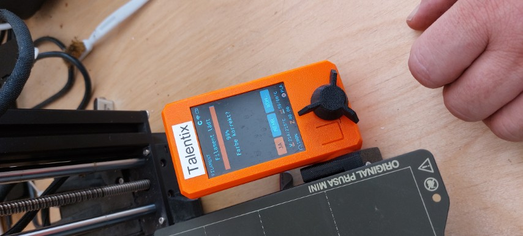

This is the first line after yaml header.

---

Admonitions

Add an **INFO** box that is expanded.

???+ info "How the post yaml header looks like..."

    ```text
    ---
    title: "This is a demo post"
    date: 2025-07-14
    ---
    ```

Use right corner handle :material-code-greater-than: to expand this **INFO**

??? info "How the `yaml` look like..."

    ```text
    ---
    title: "This is a demo post"
    date: 2025-07-14
    ---
    ```


---

Having a code block

```csharp
var foo = "bar"

```

---

And use a [link to example](https://example.com)

---

{ align=left }
And use an image with text that is floating around an image.

After a line break...

Find more information about "How to align images" in the [mkdocs-material documentation](https://squidfunk.github.io/mkdocs-material/reference/images/#image-alignment)

---

After a separator